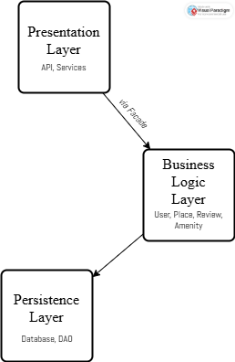
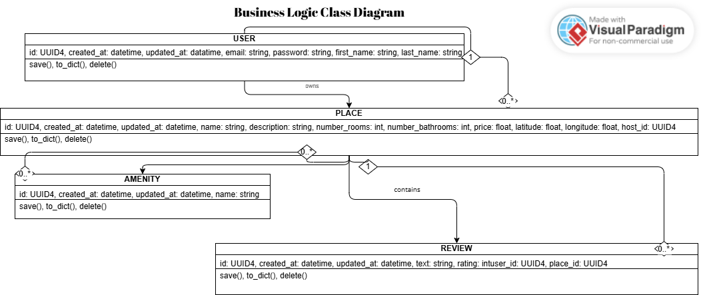
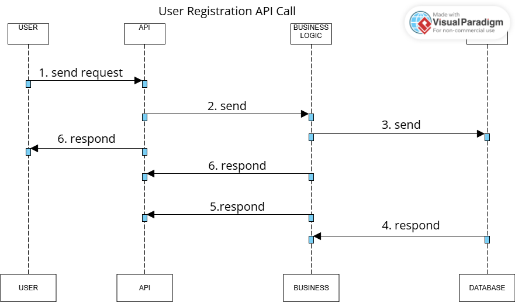
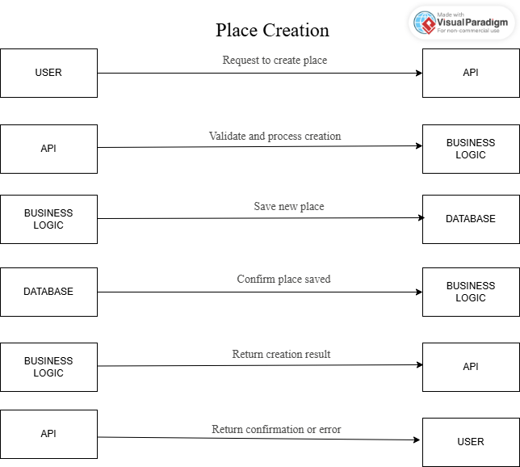
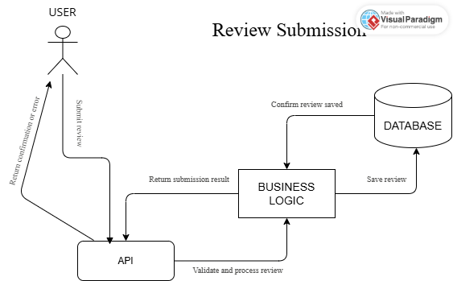
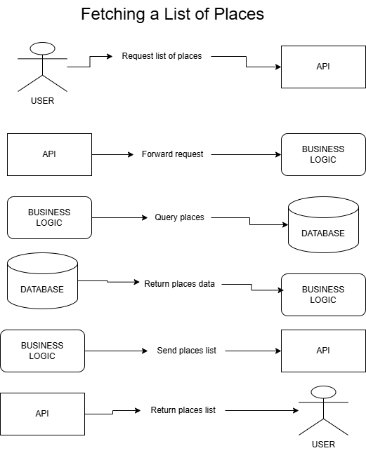

  

<h1 align="center">🏠 HBnB Project</h1>

  <b>Full-Stack Web Application developed at <a href="https://www.holbertonschool.com">Holberton School</a></b>

---

## 📚 Table of Contents

- [📌 Introduction](#-introduction)
- [🏗️ High-Level Architecture](#-high-level-architecture)
- [📘 Class Relationships](#-class-relationships)
- [🔁 Sequence Diagrams](#-sequence-diagrams)
- [👤 Author](#-author)

---

## 📌 Introduction

Welcome to the **HBnB** project!

This repository contains the architecture, technical documentation, and interaction diagrams for the HBnB web application—a clone of Airbnb—developed as part of the **Holberton School** curriculum.

> 🧱 **Tech Stack:** Python · Flask · SQLAlchemy · RESTful API · HTML/CSS · JS

---

## 🏗️ High-Level Architecture

### 📦 System Overview

#### 🧩 Layered Design

- **Presentation Layer**: Manages UI and API endpoints.
- **Business Logic Layer**: Core models and app logic (e.g., `User`, `Place`, `Review`, `Amenity`).
- **Persistence Layer**: Handles all database interactions.
- **Facade Pattern**: Acts as a bridge simplifying communications between layers.

---

## 📘 Class Relationships

### 🔗 Diagram Explanation

- **User → Place**: One-to-many ("owns").
- **Place → Review**: One-to-many ("has").
- **Place ↔ Amenity**: Many-to-many ("offers").

> 📌 Multiplicities such as `1`, `0..*` are shown on the relationship lines.

### 🖼️ UML Example

---

## 🔁 Sequence Diagrams

### 1️⃣ User Registration

> Shows the flow from user input to database record creation and response.

---

### 2️⃣ Place Creation

> Describes how a user creates a new place listing with proper data handling.

---

### 3️⃣ Review Submission

> Displays how users submit and store reviews tied to specific places.

---

### 4️⃣ Fetching Places

> Illustrates how available places are queried and returned to the user.

---

## 👤 Author

- GitHub: [MINS2405](https://github.com/MINS2405/holbertonschool-hbnb)

---

  <b>© 2025 Holberton School – HBnB Project</b>

