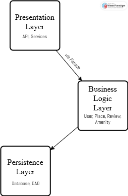

# High-Level Package Diagram

 

## Explanations

### Presentation Layer
This layer manages the interaction with the user. It exposes the services and APIs that allow users to access the application's features.

### Business Logic Layer
This layer contains the main business logic: it handles the business rules and manipulates the core models (User, Place, Review, Amenity). It acts as an intermediary between the presentation and persistence layers.

### Persistence Layer
This layer is responsible for storing and retrieving data from the database. It manages all data access operations.

### Facade Pattern
The **Facade Pattern** serves as a unified interface between the presentation layer and the business logic layer. It simplifies communication: the presentation layer does not need to know the internal details of the business logic; it always interacts through the Facade.

## Class Relationships

- **User — Place:**  
  A `User` can own multiple `Place` objects (`1` to `0..*`). This is represented by the relationship labeled **"owns"** between `User` and `Place`.

- **Place — Review:**  
  A `Place` can have multiple `Review` objects (`1` to `0..*`). This relationship is labeled **"has"** between `Place` and `Review`, indicating that a place can have many reviews.

- **Place — Amenity:**  
  There is a many-to-many relationship between `Place` and `Amenity` (`0..*` to `0..*`). This is represented by the relationship labeled **"offers"** or **"includes"** between `Place` and `Amenity`. Each place can have several amenities, and each amenity can be associated with several places.

> **Note:**  
> The multiplicity (`1`, `0..*`, etc.) is shown at each end of the relationship line in the class diagram.  
> The name of the relationship (such as "owns", "has", "offers") is placed above or below the line connecting the classes.

### Example (in text format):

.png>)
