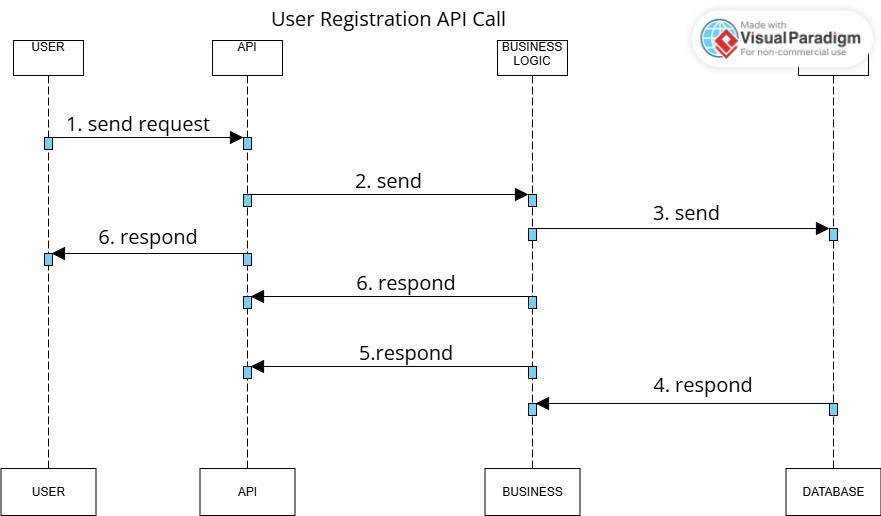

# 📦 High-Level Package Diagram

## 📝 Explanations

### 🖥️ Presentation Layer
This layer manages the interaction with the user. It exposes the services and APIs that allow users to access the application's features.

### 🧠 Business Logic Layer
This layer contains the main business logic: it handles the business rules and manipulates the core models (User, Place, Review, Amenity). It acts as an intermediary between the presentation and persistence layers.

### 💾 Persistence Layer
This layer is responsible for storing and retrieving data from the database. It manages all data access operations.

### 🛡️ Facade Pattern
The **Facade Pattern** serves as a unified interface between the presentation layer and the business logic layer. It simplifies communication: the presentation layer does not need to know the internal details of the business logic; it always interacts through the Facade.

---

## 🔗 Class Relationships

- **User — Place:**  
  A `User` can own multiple `Place` objects (`1` to `0..*`). This is represented by the relationship labeled **"owns"** between `User` and `Place`.

- **Place — Review:**  
  A `Place` can have multiple `Review` objects (`1` to `0..*`). This relationship is labeled **"has"** between `Place` and `Review`, indicating that a place can have many reviews.

- **Place — Amenity:**  
  There is a many-to-many relationship between `Place` and `Amenity` (`0..*` to `0..*`). This is represented by the relationship labeled **"offers"** or **"includes"** between `Place` and `Amenity`. Each place can have several amenities, and each amenity can be associated with several places.

> **Note:**  
> The multiplicity (`1`, `0..*`, etc.) is shown at each end of the relationship line in the class diagram.  
> The name of the relationship (such as "owns", "has", "offers") is placed above or below the line connecting the classes.

### Example (in text format):

---

# 📊 Sequence Diagrams for API Calls

## 1. User Registration

**Description:**  
This sequence diagram shows how a user registers for a new account. The user sends their registration information to the API, which passes it to the business logic for validation and creation. The business logic saves the new user in the database, and the result is returned to the user.

---

## 2. Place Creation

**Description:**  
This sequence diagram illustrates the process when a user creates a new place listing. The user submits the place details to the API, which forwards the request to the business logic layer. The business logic validates the data and saves the new place to the database. The outcome is sent back to the user.

---

## 3. Review Submission

**Description:**  
This diagram represents the steps involved when a user submits a review for a place. The user sends the review data to the API, which passes it to the business logic for validation and processing. The review is then stored in the database, and a response is returned to the user.

---

## 4. Fetching a List of Places

**Description:**  
This sequence diagram shows how a user requests a list of places based on certain criteria. The API receives the request and asks the business logic layer to retrieve the relevant places. The business logic queries the database, collects the results, and sends them back to the user through the API.

---
